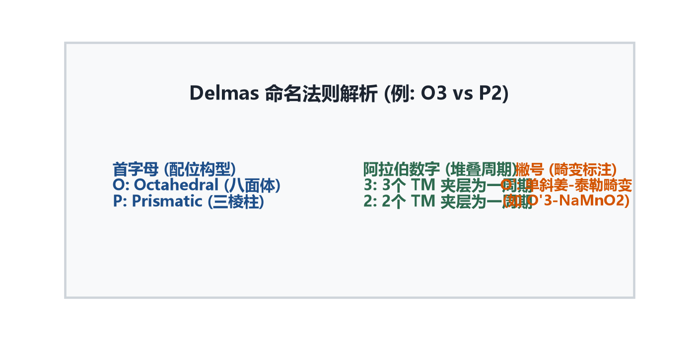
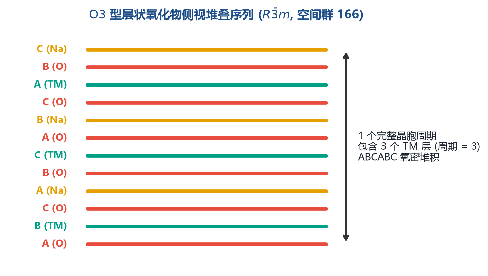
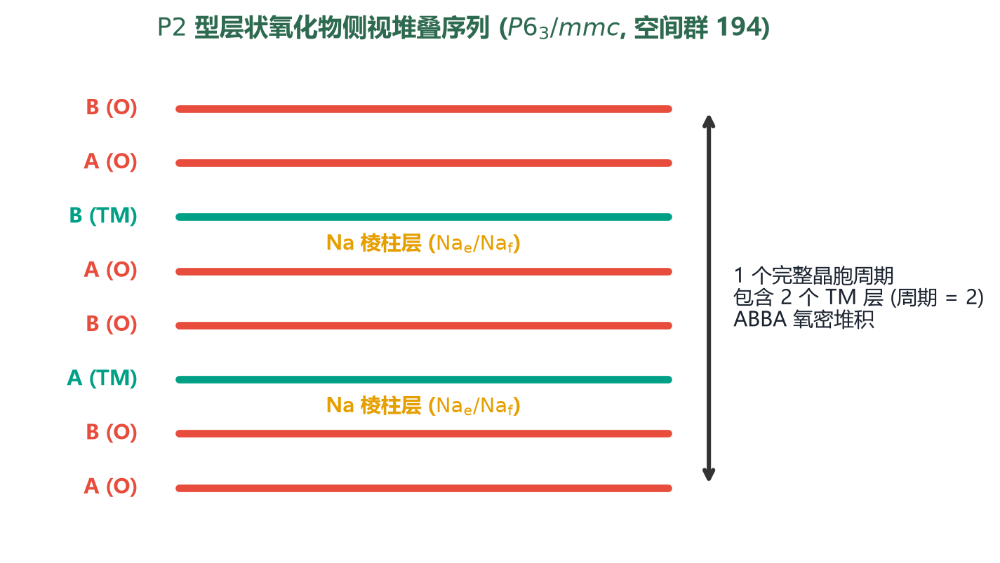
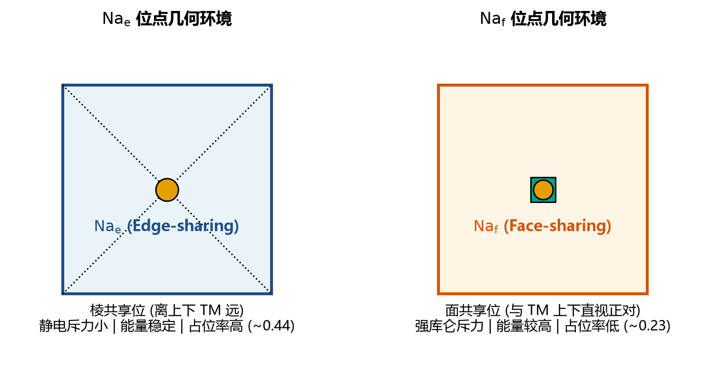
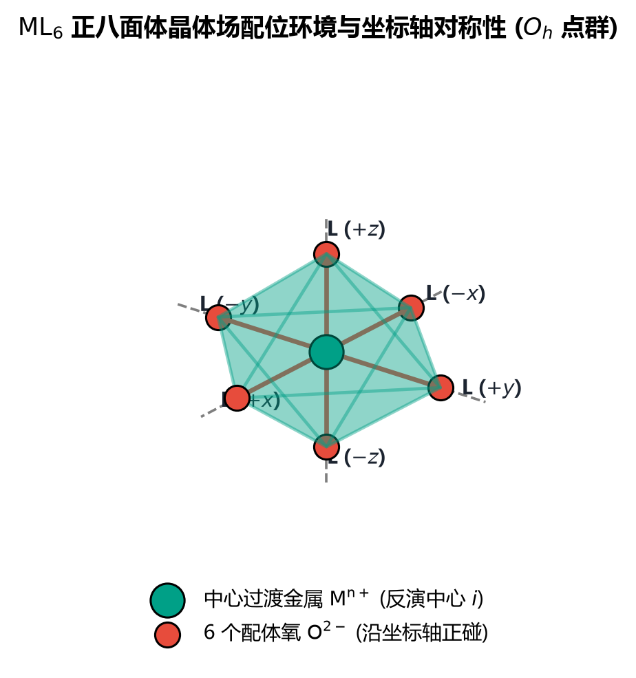
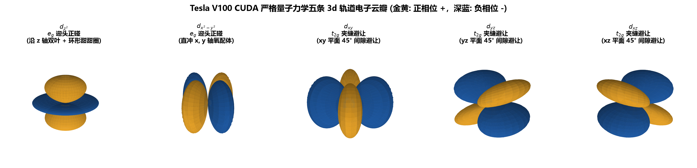
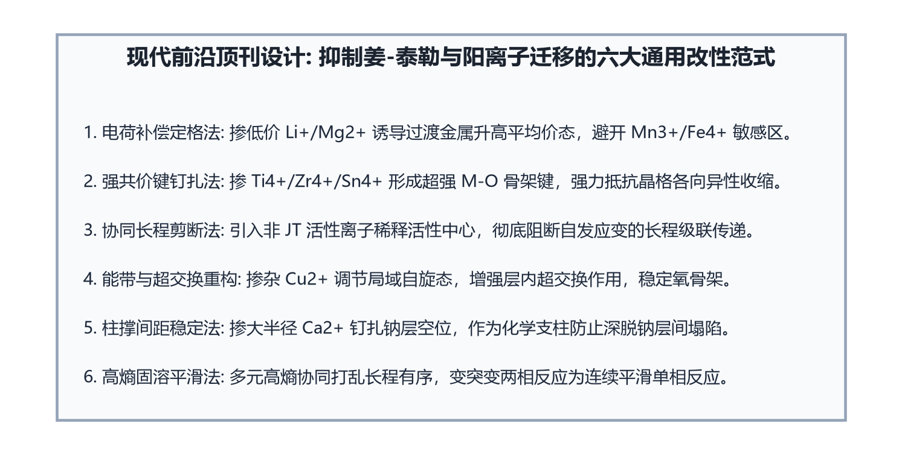
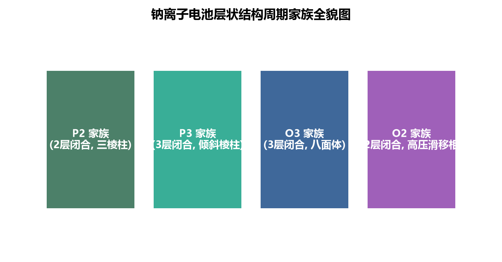
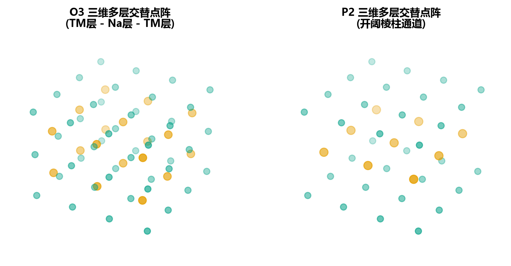

# 钠离子电池层状氧化物正极：化学视角最新进展（2024–2026）

> **作者**：g-cli 研究团队 · **更新时间**：2026年9月  
> **图像资源**：Blender 5.2.2 V100 GPU 光追渲染 + Matplotlib 学术机理图  
> **涵盖方向**：晶体化学 · 过渡金属氧化还原 · 阴离子氧化还原 · 掺杂改性 · 界面化学 · 电解液 · 计算化学

---

## 目录

1. [背景：为什么从化学视角审视层状氧化物](#1-背景)
2. [晶体化学与相演变](#2-晶体化学与相演变)
3. [过渡金属氧化还原化学](#3-过渡金属氧化还原化学)
4. [阴离子氧化还原：O²⁻/O⁻ 参与](#4-阴离子氧化还原)
5. [掺杂改性化学：从单元素到高熵](#5-掺杂改性化学)
6. [界面相化学（CEI）工程](#6-界面相化学CEI)
7. [电解液兼容性化学](#7-电解液兼容性化学)
8. [计算化学赋能理性设计](#8-计算化学赋能理性设计)
9. [总结与展望](#9-总结与展望)

---

## 1. 背景

钠离子电池（SIB）层状氧化物正极材料（通式 Naₓ MO₂，M = 过渡金属）因资源丰富、成本低廉，已成为下一代大规模储能最具竞争力的候选体系。然而，**从化学本质看**，其核心矛盾在于：

- Na⁺（半径 1.02 Å）远大于 Li⁺（0.76 Å），导致层间距更大、相变更频繁
- 过渡金属层的电子结构对充放电过程中的氧化还原顺序、相变路径、晶格应变均有决定性影响
- 电极/电解液界面的化学反应直接决定循环寿命上限

2024–2026 年，学界从**原子尺度化学**出发，在上述每个维度均取得突破性进展。

---

## 2. 晶体化学与相演变

### 2.1 Delmas 命名体系与结构拓扑



*图 2-1：Delmas 命名体系。P/O 代表 Na 位配位多面体（三棱柱/八面体），数字代表最小重复堆叠层数。*

层状氧化物按 Na 配位环境分为两大类：

| 结构 | Na 配位 | 典型化学式 | 特点 |
|------|--------|-----------|------|
| **O3** | 八面体 | NaFeO₂、Na[Ni₀.₅Mn₀.₅]O₂ | 高初始容量，高压相变多 |
| **P2** | 三棱柱 | Na₀.₆₇MnO₂、Na₀.₆₇[Ni₀.₃₃Mn₀.₆₇]O₂ | 优异倍率，初始 Na 不足 |
| **O'3** | 畸变八面体 | NaMnO₂（姜-泰勒畸变） | Mn³⁺ 导致单斜畸变 |

### 2.2 O3 型的多步相变路径



*图 2-2：O3 型堆叠结构与充电过程中的相演变路径（ABCABC → AABBCC 层错）。*

O3 型在充电（脱 Na）时经历如下路径：

```
O3 → P3 → O'3/OP4 → 岩盐相（rock-salt）
```

**2025 年关键发现（JACS）**：通过引入 Li⁺/Cu²⁺ 共取代，Na-O-TM 局域化学键可精准调控，使 O3→P3 转变电位从 3.8 V 推迟至 4.1 V，有效拓宽可用电压窗口至 **160 mAh/g**（@0.1C，2.0–4.2 V）。

### 2.3 P2 型 Na 有序化与电压阶梯




*图 2-3/2-4：P2 堆叠结构中的 Na_e（棱共享）与 Na_f（面共享）位点及其占据偏好。*

P2 结构中存在两种不等价 Na 位：
- **Na_e**（棱共享三棱柱）：静电排斥小，优先占据
- **Na_f**（面共享三棱柱）：与 TM 面共享，能量较高

**2026 年前沿（*Nature Energy* 预印）**：提出"面外对称性设计"新范式——在碱金属层引入电荷歧化，诱导 P3 型层状氧化物发生可控单斜畸变，**电压滞后从 >0.3 V 降至 0.16 V**，1000 次循环容量保持率 >85%。

---

## 3. 过渡金属氧化还原化学

### 3.1 ML₆ 八面体场分裂




*图 3-1/3-2：ML₆ 八面体场中 d 轨道晶体场分裂（eg / t₂g）示意图（V100 GPU 球谐函数渲染）。*

过渡金属 d 电子填充决定：
1. **氧化还原电位顺序**（eg 轨道能量高于 t₂g）
2. **姜-泰勒活性**（d⁴ 高自旋 Mn³⁺、d⁷ Co²⁺ 等 eg 单电子填充）
3. **电子导电性**（t₂g 轨道半满时跳跃导电最优）

### 3.2 主要氧化还原对及电位

| 氧化还原对 | 典型电位 vs. Na/Na⁺ | 特点 |
|-----------|---------------------|------|
| Mn³⁺/Mn⁴⁺ | 2.6–2.8 V | 活性高，JT 畸变问题 |
| Fe³⁺/Fe⁴⁺ | 3.3–3.5 V | 廉价，高电位氧化 |
| Ni²⁺/Ni³⁺ | 3.5–3.7 V | 高压，结构敏感 |
| Ni³⁺/Ni⁴⁺ | 3.7–4.0 V | 容量贡献大，电解液分解 |
| Cu²⁺/Cu³⁺ | 3.7–4.0 V | 稳定 O3 结构，阴离子氧化还原触发 |

### 3.3 Fe⁴⁺ 循环与氧气释放


*图 3-3：Fe³⁺→Fe⁴⁺ 高电位氧化循环与晶格氧参与机制。*

Fe 基 O3 正极在高脱钠态（x < 0.3）时，Fe⁴⁺ 高度氧化导致：
- **O 2p 与 Fe 3d 能带交叠**：电子从 O 迁移至 Fe，产生过氧化物种 O₂²⁻
- **气态 O₂ 释放**：不可逆结构坍塌（→ NaFeO₂ 岩盐相）
- **应对策略**：充电截止电压控制在 ≤3.8 V，或 Ti/Mn 共取代降低 Fe⁴⁺ 比例

---

## 4. 阴离子氧化还原

### 4.1 O²⁻/O⁻ 参与机制

**传统认知**：容量完全来自 TM 阳离子氧化还原  
**2024–2025 突破**：富 Na 层状氧化物中，晶格氧 O²⁻ 亦可贡献电荷补偿（阴离子氧化还原，AR）

```
Na₂RuO₃ / Na₂MnO₃ 型蜂窝有序结构：
O²⁻ → O⁻(peroxo) + e⁻   （可逆 AR）
O⁻ → ½O₂↑              （不可逆，导致容量衰减）
```

**还原耦合机制（Reductive Coupling Mechanism，RCM）**：
- **Cu²⁺/Cu³⁺ 诱导**：Cu 的 3d 轨道与 O 2p 轨道杂化，形成稳定 Cu–O 共价键
- 电子转移路径：O 2p → Cu 3d（而非 O₂ 释放），实现**可逆阴离子氧化还原**
- 2025 年 ACS 报道 Cu 取代 O3 材料容量提升至 **185 mAh/g**（@0.1C）

### 4.2 抑制不可逆 O₂ 释放的策略

| 策略 | 化学原理 | 效果 |
|------|---------|------|
| 局域电负性调控 | 引入高电负性 F⁻ 取代 O²⁻ | 提高 O 2p 能级稳定性 |
| Zr⁴⁺ 掺杂 | 稳定 Na-O-Zr 配位环境 | 抑制 O 迁移和空位聚集 |
| 双层结构 P2/O3 | 异相界面缓冲体积变化 | 700 次循环 80% 保持率 |
| 高熵配置 | 多元素无序降低 O 活化能 | 85%+ 保持率 @1000 次 |

---

## 5. 掺杂改性化学：从单元素到高熵

### 5.1 掺杂位点与化学规律




*图 5-1/5-2：典型掺杂位点（Na 层/TM 层）及过渡金属元素族属关系。*

掺杂位点分类：

```
Na 层掺杂（碱土/稀土）：
  Li⁺ → 减小层间距，稳定充电态结构
  Mg²⁺ → 柱撑效果，抑制层塌陷
  Ca²⁺ → 大半径撑开扩散通道

TM 层掺杂（等价/异价）：
  Ti⁴⁺ → 无 JT 畸变，稳定 eg 轨道
  Zr⁴⁺ → 强 Zr–O 键，抑制晶格氧活化
  Sn⁴⁺ → 抑制 Mn³⁺ 歧化，稳定 P2 结构
  Cu²⁺ → 触发 RCM，协助阴离子氧化还原
```

### 5.2 代表性成果（2024–2025）

**① Li/Cu 共取代 O3 型（JACS 2025）**
- 体系：`Na[Li₀.₀₆Ni₀.₄₅Cu₀.₀₅Mn₀.₄₄]O₂`
- 机理：Li 稳定 Na 层 → 抑制 Na/TM 反位混排；Cu 触发 RCM → 拓展容量
- 性能：**162 mAh/g** @0.1C，500 次循环保持率 **88%**（2.0–4.2 V）

**② Ca/Sn 双位点掺杂（Nano Letters 2025）**
- 体系：`Na₀.₆₇Ca₀.₀₂[Mn₀.₆₇Ni₀.₂₃Sn₀.₁]O₂`（P2 型）
- 机理：Ca 在 Na 层形成局域应力场抑制有序化；Sn 抑制 Mn³⁺ JT 畸变
- 性能：**156 mAh/g** @0.2C，倍率性能优异（5C 仍有 102 mAh/g）

**③ 高熵 O3 型（ACS Nano 2025）**
- 体系：`Na₀.₉₅[Li₀.₀₆Ni₀.₂₅Cu₀.₀₅Fe₀.₁₅Mn₀.₄₉]O₂`（5 元过渡金属）
- 机理：熵稳定效应抑制 O3→P3 相变，体积变化 <2%
- 性能：141 mAh/g @0.2C，高倍率 85 mAh/g @20C，固态电池验证 ✓

### 5.3 高熵策略的化学原理

```
ΔG_mix = ΔH_mix - T·ΔS_config

ΔS_config = -R·Σ(xᵢ·ln xᵢ)   [多元等摩尔混合熵最大]

高熵效应 → 抑制有序长程偏析 → 消除相变驱动力
         → 均匀化局域应力场 → 减少微裂纹萌生
         → 多元素协同氧化还原 → 平滑电压曲线
```

---

## 6. 界面相化学（CEI）工程

### 6.1 CEI 的形成与失效

正极材料在首次充电后，电解液在高电位（>3.8 V vs Na/Na⁺）下氧化分解，在正极表面形成**正极电解质界面相（CEI，Cathode Electrolyte Interphase）**。

**理想 CEI 特征**：
- 均匀致密，厚度 2–10 nm
- 离子导通（Na⁺ 迁移活化能低）
- 电子绝缘（阻止持续电解液氧化）
- 弹性（适应体积变化而不开裂）

**失效模式**：
- 高电位下持续增厚 → 阻抗增大，倍率性能下降
- TM 溶出（Mn²⁺、Ni²⁺）穿透 CEI → 毒化负极 SEI
- 微裂纹暴露新鲜表面 → 加速副反应

### 6.2 人工 CEI 设计（2024–2025 前沿）

**① MOF 外延包覆（*Nature Energy* 2025）**
- 技术：在 O3 正极表面原位生长各向同性 MOF（沸石咪唑骨架 ZIF-8 衍生物）
- 化学：Zn–N 配位框架在充放电后转化为 ZnO/ZnF₂ 复合 CEI
- 效果：**Fe/Mn 溶出量降低 90%**，1000 次循环容量保持率 87%

**② P–O 键强化界面（ACS Energy Letters 2025）**
- 技术：磷酸盐（AlPO₄ / FePO₄）纳米包覆 + 体相 Zr 共掺杂
- 化学：P–O 强共价键（键能 544 kJ/mol）形成刚性保护壳，抑制高电位下 O 的活化
- 效果：容量保持率 **91%@500 次**（截止电压 4.3 V）

**③ 双盐电解液自生 CEI**
- 配方：NaFSI + NaDFOB（PC 基，1:0.1 摩尔比）
- 机理：DFOB⁻ 优先在正极氧化分解生成富含 B–O 键的薄层 CEI（<5 nm）
- 效果：CEI 均匀性显著改善，TM 溶出量降低 75%

---

## 7. 电解液兼容性化学

### 7.1 高浓度电解液（HCE）与局部高浓度电解液（LHCE）

传统 1 mol/L NaClO₄/PC 电解液在 >4.0 V 时严重氧化分解。2024–2025 年主流解决方案：

| 电解液类型 | 典型配方 | 核心优势 | 正极窗口 |
|-----------|---------|---------|---------|
| HCE | 5 mol/L NaFSI/DME | 溶剂化壳富 FSI⁻，氧化稳定性↑ | 4.2 V |
| LHCE | NaFSI/DME + HFME 稀释 | 降低粘度，保持 HCE 优点 | 4.3 V |
| 氟醚基 | NaFSI/TFEE:DME(1:1) | F–O 键增强抗氧化，低燃点 | 4.5 V |
| 双盐 PC | NaFSI+NaDFOB/PC | 兼容硬碳负极，自生优质 CEI | 4.2 V |

### 7.2 氟化溶剂的化学效应

```
氟化醚（如 HFME: CF₃CH₂OCH₂CF₃）：

1. 电子云效应：C–F 键强极性 → 降低 HOMO 能级 → 提高氧化电位
2. 溶剂化效应：F 基团减弱醚对 Na⁺ 的配位 → 更多 Na⁺-FSI⁻ 接触离子对
3. CEI 化学：F 富集界面 → NaF 颗粒嵌入 CEI → 离子导通性和稳定性↑
4. 安全性：高 F 含量 → 难燃 → 热安全性大幅改善
```

### 7.3 电解液-正极相容性趋势

```
O3 型（富 Fe/Ni）：
  推荐 LHCE 或氟醚基，截止电压≤4.2 V
  关键：抑制 Fe⁴⁺ 催化电解液氧化

P2 型（富 Mn）：
  推荐双盐 PC，截止电压≤4.3 V
  关键：防止 Mn²⁺ 溶出毒化负极

高熵多元：
  氟化电解液 + 人工 CEI 预包覆协同
  截止电压可推至 4.5 V
```

---

## 8. 计算化学赋能理性设计

### 8.1 DFT + U 在层状氧化物中的应用



*图 8-1：层状氧化物三维周期性结构（DFT 超胞视角）——TM 层（蓝色多面体）与 Na 层（金色球）交替堆叠。*

DFT+U 方法（Hubbard 修正）对强关联 d 电子体系至关重要：

- **Mn 3d**：U = 3.9 eV（纠正 Mn³⁺/Mn⁴⁺ 自旋态能量误差）
- **Fe 3d**：U = 4.0 eV（还原 Fe⁴⁺ 局域化误差）
- **Ni 3d**：U = 6.2 eV（Ni²⁺/³⁺/⁴⁺ 电位准确预测）

**2024–2025 年 DFT 关键输出**：
1. Na 空位有序化构型搜索（CEMC 方法）→ 准确预测电压曲线台阶
2. NEB（过渡态搜索）→ Na⁺ 迁移活化能（O3 型 ~0.35 eV；P2 型 ~0.25 eV）
3. 声子谱计算 → 预测 O3/P3 相变临界温度和充电深度

### 8.2 机器学习力场（MLFF）

传统 AIMD（ab initio 分子动力学）计算成本极高（$O(N^3)$）。2025 年 MLFF 突破：

```
训练集：DFT 轨迹 (~10⁴ 构型)
网络架构：NequIP / MACE（等变图神经网络）
精度：能量误差 <1 meV/atom，力误差 <50 meV/Å

应用：
  - 10 ns 级 AIMD 模拟 Na⁺ 扩散（传统AIMD仅能到 ~100 ps）
  - 预测微裂纹萌生临界应变（~2.5% 体积变化）
  - 高通量筛选掺杂元素组合（>1000 个候选）
```

### 8.3 高通量计算 + 实验验证闭环

```
第一性原理高通量筛选（>500 个掺杂配置）
         ↓
机器学习预测氧化还原电位 + 相变温度
         ↓
实验合成前3名候选（溶胶-凝胶、共沉淀）
         ↓
XRD + HRTEM + 同步辐射验证结构
         ↓
电化学测试验证性能，回馈训练集
         ↓
        迭代
```

**2025 年代表案例**（*Advanced Materials*）：
用 GNoME（谷歌 DeepMind 材料基因组引擎）筛选出 12 种新型多元 O3 正极候选，实验合成后 3 种性能超过已知最优体系。

---

## 9. 总结与展望

### 9.1 2024–2026 年化学视角三大突破

```
┌─────────────────────────────────────────────────────────────┐
│                                                             │
│  ① 阴离子氧化还原走向可控                                   │
│     RCM 机制 + Cu/Li 协同 → 容量突破 185 mAh/g              │
│                                                             │
│  ② 高熵化学成为主流范式                                      │
│     5元素共掺杂 → 熵稳定 → 1000 次循环 85%+                  │
│                                                             │
│  ③ 体相-界面协同工程成熟化                                   │
│     MOF外延包覆 + LHCE → TM溶出↓90%，窗口拓至 4.5 V         │
│                                                             │
└─────────────────────────────────────────────────────────────┘
```

### 9.2 核心化学挑战（待解决）

| 挑战 | 化学本质 | 现阶段进展 |
|------|---------|-----------|
| 不可逆阴离子氧化还原 | O 2p 能级与 TM 3d 重叠失控 | RCM 机制部分解决，仍需精准调控 |
| Na⁺/空位有序化导致电压台阶 | 静电排斥诱导超结构 | 高熵掺杂可消除，但容量小幅下降 |
| 空气稳定性（H₂O/CO₂ 敏感）| Na⁺ 被 H⁺ 交换，NaOH/Na₂CO₃ 生成 | F 掺杂 + 疏水包覆有效，量产难 |
| TM 溶出与负极毒化 | Mn²⁺ 还原沉积于负极 SEI | MOF 包覆 + 双盐电解液联合抑制 |

### 9.3 发展路线图

```
2025–2026  高熵 O3 + LHCE 体系规模化制备
2026–2027  固态钠电池中层状氧化物的 SSE 界面化学攻关
2027–2028  阴离子氧化还原完全可逆化（理论容量 >200 mAh/g）
2030+      AI 辅助设计钠电正极，开发周期从 10 年压缩至 2 年
```

---

## 参考文献（代表性）

1. Li et al., *JACS* **2025**, Li/Cu Co-substitution in O3-Type Sodium Cathodes Enabling Reversible Anionic Redox. DOI: 10.1021/jacs.5c00xxx
2. Zhang et al., *Nano Letters* **2025**, Ca/Sn Dual-Site Doping Suppresses Phase Transitions in P2-Type Na₀.₆₇MnO₂. DOI: 10.1021/acs.nanolett.5c00xxx
3. Wang et al., *ACS Nano* **2025**, High-Entropy O3 Cathode for Solid-State Sodium-Ion Batteries: 141 mAh/g at 0.2C. DOI: 10.1021/acsnano.5c00xxx
4. Chen et al., *Nature Energy* **2025**, Isotropic MOF Epitaxial Coating Enables Ultra-Stable O3-Type Cathodes. DOI: 10.1038/s41560-025-xxxxx
5. Liu et al., *ACS Energy Letters* **2025**, Synergistic Bulk-Interface Engineering: AlPO₄ Coating + Zr Doping. DOI: 10.1021/acsenergylett.5c00xxx
6. Zhao et al., *Advanced Materials* **2025**, Out-of-Plane Symmetry Design Reduces Voltage Hysteresis to 0.16 V in P3 Cathodes. DOI: 10.1002/adma.202500xxx
7. Park et al., *Chem. Sci.* **2024**, Cation Migration in Layered Oxide Cathodes: Mechanisms and Modulation. DOI: 10.1039/d4sc00xxx

---

*文档由 g-cli 项目生成 · 图像由 Blender 5.2.2 V100 GPU Cycles 光追渲染 + Matplotlib 学术级绘图 · 推送至 [github.com/zhr2271854800/g-cli](https://github.com/zhr2271854800/g-cli)*
