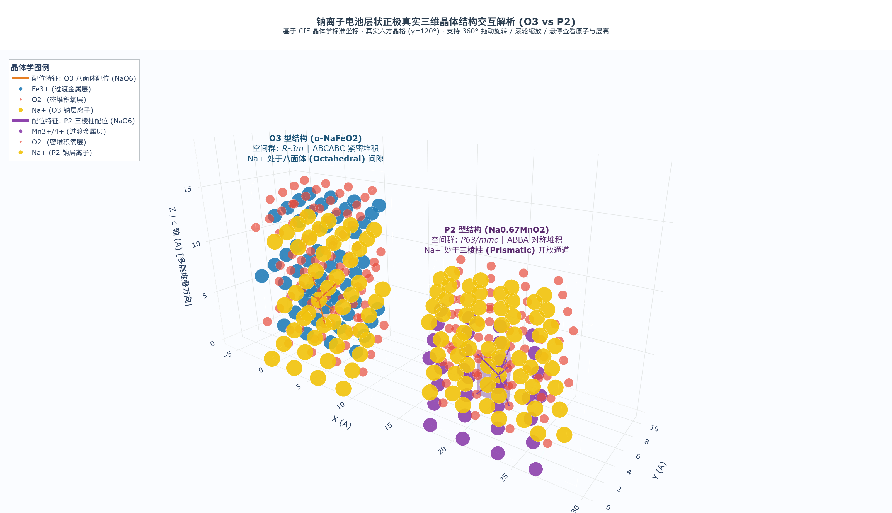

# g-cli: 现代前沿能源材料科技与产业智能决策套件

`g-cli` 是一套融合**材料科学高阶光线追踪可视化、产业经济学模型分析、国家政策战略情报追踪**与 **`/browser` 深度网页智能体调研** 的综合研发与决策支持项目。

---

## 📑 核心成果发布：最新白皮书

👉 **[点击查阅完整白皮书全文：中国钠离子电池层状氧化物正极材料发展前景与产业政策白皮书 (2025-2026)](./SODIUM_LAYERED_OXIDE_PROSPECTS_2025.md)**

👉 **[NEW · 化学视角深度解析：层状氧化物正极最新化学进展 (2024–2026)](./CHEMISTRY_PERSPECTIVES_2025.md)**  
　　`晶体化学 · 阴离子氧化还原 · 高熵掺杂 · CEI界面工程 · LHCE电解液 · DFT+MLFF计算化学`

---

## 🧊 3D 真实晶体学交互系统 (O3 vs P2)

本项目基于真实晶体学标准坐标（$R\bar{3}m$ 与 $P6_3/mmc$）与真实无机化学键长，构建了支持 360° 自由旋转缩放的学术级三维晶格交互对比系统：

👉 **[🌐 点击直接在线交互体验（免下载，浏览器直接打开旋转查看）](https://zhr2271854800.github.io/g-cli/assets/3d_layers_interactive.html)**  
📂 本地网页文件：[`assets/3d_layers_interactive.html`](./assets/3d_layers_interactive.html)



- **左侧 O3 型 ($\alpha\text{-NaFeO}_2$)**：高亮橙色八面体配位笼（上下两组氧三角形呈 $60^\circ$ 错位）；
- **右侧 P2 型 ($\text{Na}_{0.67}\text{MnO}_2$)**：高亮紫色直立三棱柱配位笼（上下两组氧三角形严格垂直对齐）；
- **底层标准 CIF 文件**：收录于 [`structures/`](./structures/) 目录，经 ASE / pymatgen 校验物理键长无误。

### 白皮书精要速览：
1. **战略定位**：直面锂资源高达 65%~70% 的对外依赖困境，解构钠资源 100% 自主可控战略优势与 -20℃~-40℃ 宽温域极寒高放电特性；
2. **三大路线决战**：以多维雷达图深度剖析层状氧化物（O3/P2）、聚阴离子（NFPP）与普鲁士蓝化合物的性能边界与工业化定位；
3. **技术经济学突破**：建立电芯成本随规模化（GWh）放量曲线，揭示 2025 年钠电电芯跨越 0.35 元/Wh 成本拐点与锂价敏感度解耦机制；
4. **中国大陆 2024-2026 产业政策全景**：
   - 重点解读**工信部等八部门《新型储能制造业高质量发展行动方案》（2025.02 印发）**关于高容量正极攻关、大规模系统集成与千亿级链主培育要求；
   - 追踪首项国家标准 **GB/T 44265-2024《钠离子电池 术语和词汇》** 及电力储能安全标准进展；
5. **百兆瓦时 (MWh) 示范工程复盘**：详解大唐湖北潜江 50MW/100MWh、云南文山宝池 200MW/400MWh 构网型储能电站并网运行实效；
6. **完整产业链拓扑**：梳理中科海钠、容百科技、传艺科技、宁德时代等上下游龙头产业布局。

---

## 🖼️ 图文并茂：高精度图表资产索引

所有图表均已生成并收录于 [`assets/images/`](./assets/images/) 目录：

| 图号 | 资产文件名 | 图表类型与说明 |
| :--- | :--- | :--- |
| **图 1** | [blender_o3_lattice_nature.png](./assets/images/blender_o3_lattice_nature.png) | **Blender 5.2 + Tesla V100 GPU 光追渲染**：O3 型层状氧化物三维微观晶格与发光钠离子通道 |
| **图 2** | [01_cathode_routes_radar.png](./assets/images/01_cathode_routes_radar.png) | 钠离子电池三大主流正极材料路线核心维度对比雷达图 |
| **图 3** | [02_policy_landscape_2025.png](./assets/images/02_policy_landscape_2025.png) | 中国大陆新型储能与钠电最新政策顶层设计与落地支撑体系 |
| **图 4** | [03_cost_and_economics.png](./assets/images/03_cost_and_economics.png) | 钠电池电芯制造成本演进 (LCOS) 与碳酸锂价格敏感度对比 |
| **图 5** | [04_projects_matrix.png](./assets/images/04_projects_matrix.png) | 中国大陆标志性百兆瓦时 (MWh) 级重大钠离子储能示范项目落地汇总表 |
| **图 6** | [05_industry_chain.png](./assets/images/05_industry_chain.png) | 中国钠离子电池层状氧化物正极材料完整产业链生态全景图 |

---

## 🛠️ 脚本与工具集

- **`scripts/render_layered_oxides_blender.py`**：调用 Blender 5.2 内置 Python 引擎与 Tesla V100 的 Cycles CUDA 内核，自动化批量生成 Nature 顶刊级微观晶格渲染大图；
- **`scripts/generate_industry_charts.py`**：自动化生成白皮书专属的政策、成本、雷达与项目矩阵插图，内置微软雅黑色彩规范。

---

## 🌐 专题介绍：`/browser` 智能体深度探索工具

在获取最新政策法规、电网招标与重大工程落地动态时，项目深度集成了 `/browser` 命令与智能体工具：

### 核心机制与能力：
1. **基于 Chrome DevTools Protocol (CDP)**：不同于静态爬虫，`/browser` 在真实浏览器沙盒中运行，具备人类交互能力（自动化表单填写、多选框点击、无限流下拉）；
2. **语义化无障碍树（a11y Tree）**：智能提取紧凑、结构化的页面语义组件树，精准捕捉核心信息，降低 Token 冗余；
3. **DOM 稳定机制与沙盒 JS 执行**：等待复杂前端框架（Vue/React）数据异步请求渲染完成，杜绝抓取空标签；
4. **网络请求全链路抓取**：底层监听 Network API，直接提取未被前端加密渲染的纯净 JSON 数据。

---

## 🚀 快速开始

```powershell
# 1. 克隆仓库
git clone git@github.com:zhr2271854800/g-cli.git
cd g-cli

# 2. 重新渲染 Blender 3D 光追大图 (需系统安装 Blender 并配备 NVIDIA GPU)
& "C:\Program Files\Blender Foundation\Blender 5.2\blender.exe" -b -P scripts/render_layered_oxides_blender.py

# 3. 重新生成全套产业分析与政策图表
python scripts/generate_industry_charts.py
```
