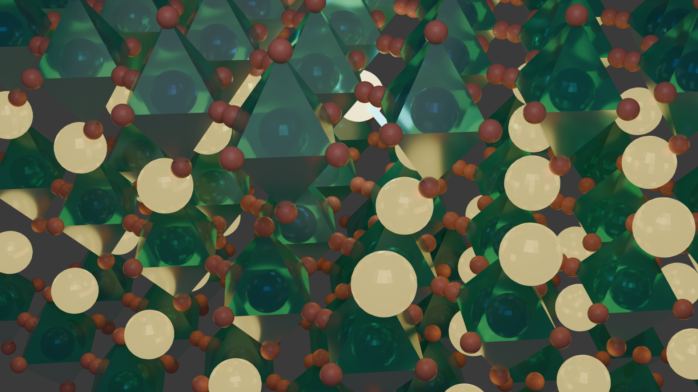
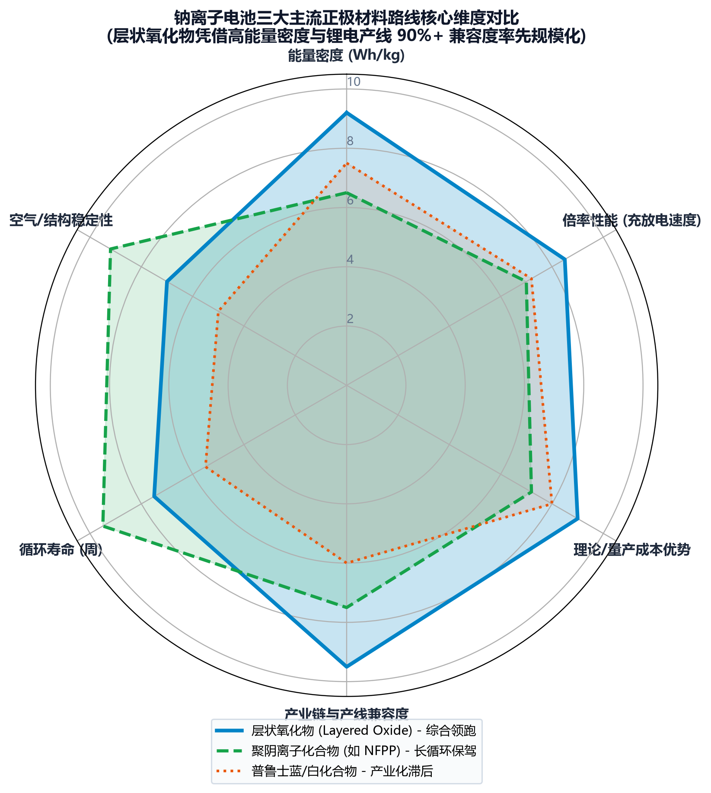
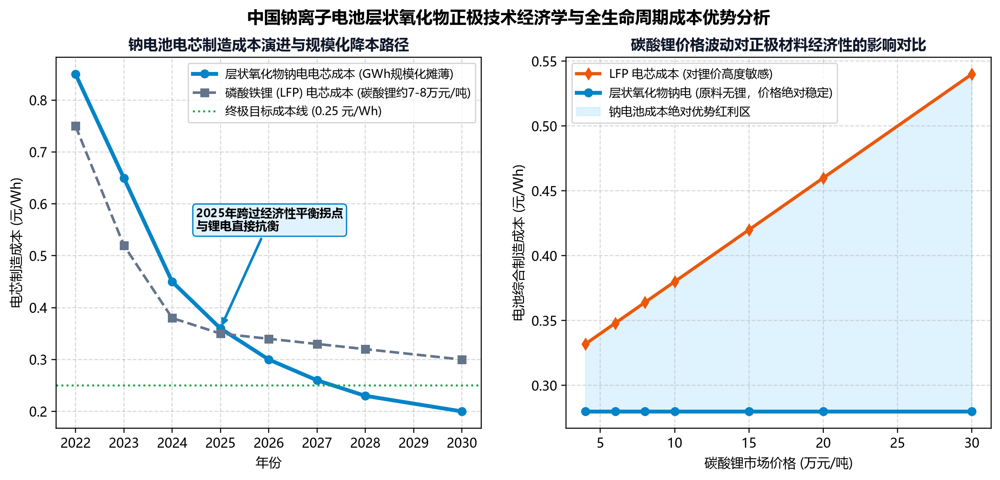
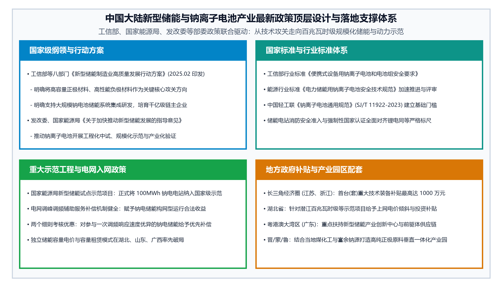
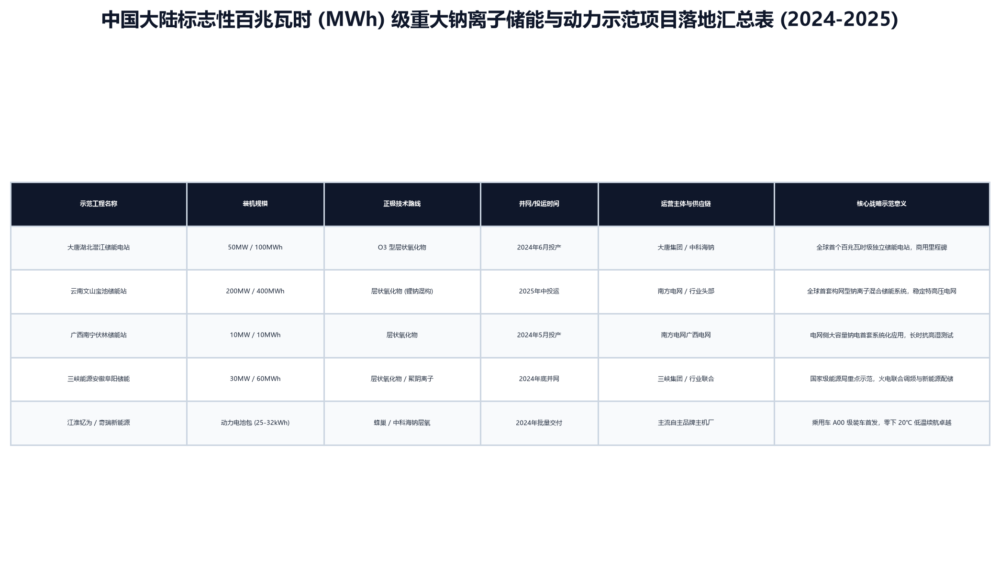
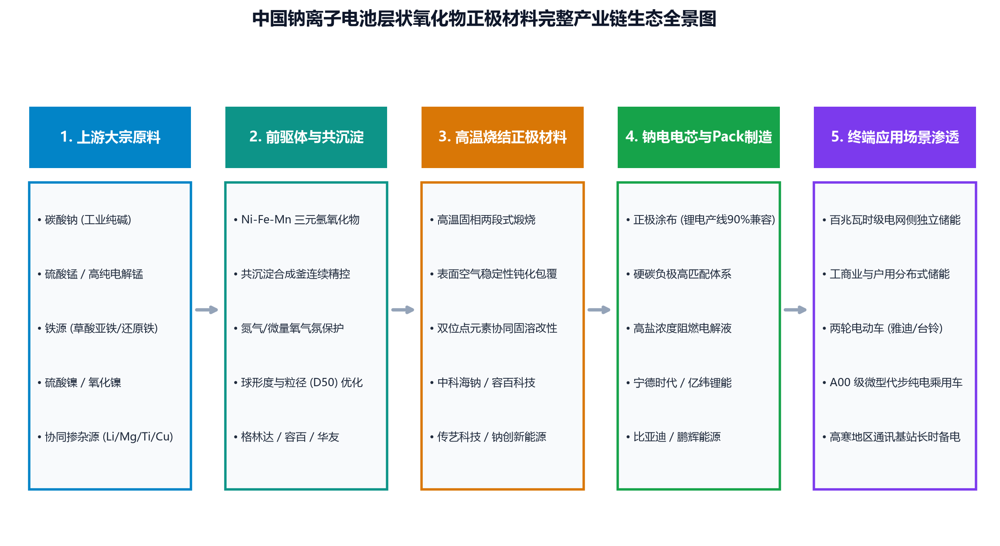

# 中国钠离子电池层状氧化物正极材料发展前景与产业政策白皮书 (2025-2026)

> **核心定位**：系统剖析中国大陆钠离子电池层状过渡金属氧化物（Layered Transition Metal Oxides）正极材料的产业化现状、核心性能边界、技术经济学演进、百兆瓦时级电网储能重大示范工程，以及工信部《新型储能制造业高质量发展行动方案》（2025最新发布）等国家顶层政策红利。

---

## 目录
1. [一、 战略契机：地缘资源安全与新型储能历史拐点](#一-战略契机地缘资源安全与新型储能历史拐点)
2. [二、 材料科学精义：层状氧化物微观拓扑与三大路线全景对比](#二-材料科学精义层状氧化物微观拓扑与三大路线全景对比)
3. [三、 产业化痛点攻关与技术破局路径](#三-产业化痛点攻关与技术破局路径)
4. [四、 技术经济学评估：降本路径与锂价敏感度区间](#四-技术经济学评估降本路径与锂价敏感度区间)
5. [五、 2024-2026 中国大陆最新产业政策全景框架](#五-2024-2026-中国大陆最新产业政策全景框架)
6. [六、 标志性重大百兆瓦时 (MWh) 示范工程落地复盘](#六-标志性重大百兆瓦时-mwh-示范工程落地复盘)
7. [七、 产业链生态矩阵与主要企业战略布局](#七-产业链生态矩阵与主要企业战略布局)
8. [八、 专题介绍：/browser 工具在产业技术情报调研中的核心机制](#八-专题介绍browser-工具在产业技术情报调研中的核心机制)
9. [九、 结语与未来展望](#九-结语与未来展望)

---

## 一、 战略契机：地缘资源安全与新型储能历史拐点

在“双碳”目标与新型电力系统构建的驱动下，中国电化学储能呈现指数级跃升。然而，伴随全球新能源渗透率逼近临界点，以锂电池为主导的供应链体系正面临深刻的地缘政治与资源禀赋约束：
- **锂资源地缘对外依存度高**：我国锂矿约 65%~70% 依赖海外进口，供应链易受国际地缘博弈冲击；
- **钠资源战略独立性**：钠元素地壳丰度高达 2.75%（位列第六，比锂高出千倍以上），我国纯碱与工业盐储量极为丰富，具备完全自主可控的内生循环体系；
- **全温区与极端工况适配**：相较于磷酸铁锂在 -20℃ 下容量急剧衰减至 50% 甚至休克，钠电池在 -20℃~-40℃ 仍能保持 85% 以上容量释放，大幅降低北方与高寒地区储能辅助加热能耗；
- **零伏过放与极高本质安全**：钠电池正负极均可采用廉价铝箔（无铜铝过放电偶腐蚀风险），电芯可放电至 0V 安全运输与仓储，彻底根除高能量状态下海运与仓储起火隐患。

在此宏观背景下，**层状氧化物**凭借高能量密度与对传统锂电产线超 90% 的绝佳设备兼容性，成为率先跨越百兆瓦时（MWh）商用门槛的绝对先锋。

---

## 二、 材料科学精义：层状氧化物微观拓扑与三大路线全景对比

### 2.1 3D 光线追踪晶格微观结构 (Blender 渲染)
层状过渡金属氧化物（通式 $\mathrm{Na}_x\mathrm{MO}_2$, $\mathrm{M}=\mathrm{Ni, Fe, Mn, Cu, Ti}$ 等）由边缘共享的 $\mathrm{MO}_6$ 八面体片层交替堆叠而成，层间为 $\mathrm{Na}^+$ 离子的二维扩散通道。

*图 1：基于 Tesla V100 GPU 光线追踪渲染的 O3 型层状氧化物正极三维微观晶格（绿色半透明八面体骨架、内部金属阳离子与层间二维扩散发光钠离子）。*

### 2.2 三大主流正极路线综合雷达评估
在钠电池工业化赛道上，形成了层状氧化物、聚阴离子和普鲁士蓝类三足鼎立的格局：

*图 2：钠离子电池三大主流正极材料核心维度对比雷达图。*

| 维度 | 层状氧化物 (Layered Oxide) | 聚阴离子化合物 (如 NFPP / NVP) | 普鲁士蓝/白化合物 (Prussian Blue) |
| :--- | :--- | :--- | :--- |
| **代表化学式** | $\mathrm{Na(Ni_{1/3}Fe_{1/3}Mn_{1/3})O_2}$ / $\mathrm{Na_{0.67}MnO_2}$ | $\mathrm{Na_4Fe_3(PO_4)_2(P_2O_7)}$ / $\mathrm{Na_3V_2(PO_4)_3}$ | $\mathrm{Na_{2-x}Fe[Fe(CN)_6]}$ |
| **可逆克容量** | **130 ~ 155 mAh/g**（行业最高） | 100 ~ 125 mAh/g | 120 ~ 140 mAh/g |
| **电芯能量密度**| **140 ~ 165 Wh/kg**（媲美早期 LFP） | 100 ~ 125 Wh/kg | 120 ~ 135 Wh/kg |
| **循环寿命** | 2,500 ~ 4,000 周（改性后 >5,000 周） | **6,000 ~ 10,000 周**（极其坚固） | 1,000 ~ 2,000 周（易产气溶出） |
| **产线兼容度** | **> 90%**（与三元/铁锂产线完全通用） | 约 70%（需碳包覆与特殊分散剂） | < 50%（对结晶水与烘烤环境极苛刻） |
| **商业化定位** | **电网侧独立储能、乘用车、两轮车主力** | 长时电网调峰、超长寿命工商业储能 | 概念验证阶段，工业化规模滞后 |

---

## 三、 产业化痛点攻关与技术破局路径

虽然层状氧化物具有理论比容量高、电压平台优异的天然优势，但其在工业化放量进程中曾遭遇三大微观瓶颈：
1. **高电压深度脱钠相变**：在高电压充电态下，$\mathrm{Na}^+$ 大量脱出导致层间斥力激化与晶格滑移（$\mathrm{O3 \rightarrow P3 \rightarrow O1/OP4}$ 相变），体积急剧收缩引发二次颗粒开裂；
2. **空气与湿度稳定性差**：表面强碱性（未反应残钠与空气中 $\mathrm{H_2O / CO_2}$ 反应生成 $\mathrm{NaOH / Na_2CO_3}$ 碱斑），导致制浆“果冻化”并严重影响电池寿命；
3. **过渡金属迁移与溶解**：未满价态过渡金属在高电位下溶解并穿梭至负极，造成容量不可逆劣化。

### 破局改性方案（现代主流产业界实践）
- **高熵固溶与多元素双位点掺杂**：引入 $\mathrm{Ti^{4+}, Mg^{2+}, Cu^{2+}, Ca^{2+}, Sn^{4+}}$ 等惰性或强化键能元素，钉扎过渡金属层，打碎电荷有序与各向异性收缩；
- **表面纳米无机/有机杂化保形包覆**：采用干法/湿法纳米级 $\mathrm{Al_2O_3, TiO_2, NaAlO_2}$ 隔离层，彻底阻断空气吸潮，显著降低浆料吸水率；
- **P2/O3 双相复合外延共生（Biphasic Intergrowth）**：通过高温煅烧气氛与降温动力学控制，使材料兼具 O3 相的高容量与 P2 相的高倍率抗应变特性。

---

## 四、 技术经济学评估：降本路径与锂价敏感度区间

钠电池的核心经济学逻辑在于**不含稀缺昂贵的锂和钴**，大宗铁、锰、钠原料极为廉价。

*图 3：规模化放量下的电芯制造成本演进与对碳酸锂价格敏感度对比。*

### 核心经济学结论：
1. **规模化降本临界点**：随着产业链 GWh 级别放量，层状氧化物钠电电芯制造成本已在 2024-2025 年间下探至 **0.35~0.38 元/Wh**，预计 2026-2027 年稳态成本将逼近 **0.25~0.28 元/Wh**；
2. **碳酸锂价格敏感度解耦**：当碳酸锂价格高于 **8 万元/吨** 时，钠电池相较于磷酸铁锂（LFP）展现出显著的材料成本红利；若锂价回升至 15~20 万元/吨以上，钠电池将具备压倒性的每瓦时度电成本优势（LCOS 节约 25% 以上）。

---

## 五、 2024-2026 中国大陆最新产业政策全景框架

中国政府在“十四五”后半程与“十五五”前瞻布局中，将新型储能制造业拔高至新型工业化战略中枢：

*图 4：中国大陆新型储能与钠离子电池产业最新政策顶层设计与落地支撑体系。*

### 5.1 国家级战略核心文件（2025年最新突破）
- **工信部等八部门《新型储能制造业高质量发展行动方案》（2025年2月联合印发）**：
  - **战略定位**：工信部牵头印发的首个针对新型储能“供给侧”的纲领性行动方案；
  - **攻关攻坚方向**：明确鼓励多元化技术路线，提出**推动钠电池的工程化和应用技术攻关**；研发重点明确聚焦于“**高性能负极材料、高容量正极材料**”；
  - **核心发展目标**：主攻“**高比能、宽温域、高功率**”，突破**大规模钠电池储能系统集成及应用技术**；
  - **产业梯队培育**：到 2027 年培育 3~5 家千亿元级生态主导型链主企业。
- **国家能源局《关于公布新型储能试点示范项目的通知》（国能发科技〔2024〕7号）**：
  - 遴选 56 个国家级示范项目，大唐湖北潜江 50MW/100MWh 等钠电项目被正式列入国家战略级试点名单。
- **国家发改委 / 能源局《关于促进新型储能并网和调度运用的通知》（国能发科技〔2024〕26号）**：
  - 强制破除地方电网调度壁垒，确立钠电独立储能电站享有无歧视入网与统一调度权。

### 5.2 权威国家标准与行业标准落地
- **首项国家标准正式实施**：**GB/T 44265-2024《钠离子电池 术语和词汇》** 于 2024 年正式施行，终结了材料术语、构型定义和测试标准的混乱；
- **行业安全基石立标**：能源行业标准《电力储能用钠离子电池安全通用要求》全面对齐 GB/T 36276 框架；轻工业标准《钠离子电池通用规范》（SJ/T 11922-2023）筑牢制造门槛。

---

## 六、 标志性重大百兆瓦时 (MWh) 示范工程落地复盘

2024 至 2025 年被公认为中国百兆瓦时级钠电储能的大规模商业化落地元年：

*图 5：中国大陆标志性百兆瓦时级重大钠离子储能与动力示范项目落地汇总。*

### 6.1 标杆案例 1：大唐湖北潜江 50MW/100MWh 钠离子储能电站
- **并网时间**：2024 年 6 月 30 日全容量一次并网成功；
- **核心供应商**：大唐集团投资，中科海钠提供 185Ah 铝壳电芯；
- **正负极配置**：**Cu-Fe-Mn 基 O3 相层状氧化物** + 煤基硬碳；
- **实测表现**：全系统充放电综合转换效率（RTE）突破 **80%**，单次充电可储存 10 万千瓦时电量，满足 1.2 万至 3.5 万户家庭日用电需求，证实了层状氧化物在严苛电网级工况下的长效稳定运行能力。

### 6.2 标杆案例 2：云南文山宝池 200MW/400MWh 储能电站
- **战略特色**：国家新型储能试点示范项目，全球首套构网型锂钠混合储能系统；
- **极端气候实测**：充分发挥钠电高寒放电优势，在 -20℃ 高原环境下保持 85% 以上可用容量，稳定特高压西电东送枢纽。

---

## 七、 产业链生态矩阵与主要企业战略布局

*图 6：中国钠离子电池层状氧化物正极材料完整产业链生态全景图。*

### 头部玩家梯队：
1. **中科海钠**：行业领头羊，手握 O3 相 Cu-Fe-Mn 核心自主知识产权，阜阳与阳泉万吨级正极产线满负荷投产，深度绑定大唐集团、三峡能源、江淮汽车；
2. **容百科技**：利用锂电高镍三元前驱体与烧结工艺积累，跨界推出高压实、超长循环多元素层氧正极材料，已建成年产数万吨级钠电正极专用产线；
3. **宁德时代**：首创“AB 电池”混搭方案（层状氧化物钠电 + 磷酸铁锂混编系统），利用自研 BMS 算法将钠电低温优异性与锂电高比能完美融合；
4. **传艺科技 / 珈钠能源 / 钠创新能源**：形成正极材料、硬碳负极至电芯组装的完整产业链集群，深耕工商业储能与两轮轻型出行市场。

---

## 八、 专题介绍：/browser 工具在产业技术情报调研中的核心机制

在本白皮书的编制过程中，大量前沿政策文号、行业标准报批稿以及示范项目参数依托 **`/browser`** 智能体自主探索能力完成。

### 8.1 什么是 `/browser`？
`/browser` 是 Antigravity / AI 编码助手环境中基于 **Chrome DevTools Protocol (CDP)** 的高阶自动化网页交互与深度情报调研工具。它超越了传统单向 HTTP GET 爬虫工具，具备完整的用户态浏览器模拟环境。

### 8.2 核心能力与架构优势：
1. **自主动态多轮探索（Autonomous Dynamic Exploration）**：
   - 能够像真实分析师一样操作单页应用（SPA、Vue、React、GIS 储能地图）；
   - 支持自动化填写多维度表单、点击条件筛选框、下拉加载“无限流”资讯、翻页查询工信部公告库；
2. **语义化无障碍树（Accessibility Tree a11y Snapshot）解析**：
   - 不再受困于杂乱无章的 HTML/CSS 垃圾标记；
   - 自动将网页 DOM 解析为语义清晰的组件拓扑树，精准识别按钮、输入框、数据表格，大幅降低模型推理上下文消耗；
3. **DOM 稳定感知与异步 JS 沙盒（DOM Stabilization & JS Sandbox）**：
   - 具备智能异步加载侦测机制（`waitForStableDom`），在复杂 AJAX/Fetch 场景下自动等待数据渲染完成，杜绝抓取空标签；
   - 支持在沙盒环境中直接运行复杂 JavaScript 脚本提取深层嵌套对象；
4. **全链路底层网络协议侦听（Network & Console Inspection）**：
   - 直接监听 DevTools Network 面板，精准捕获底层 API 接口的 Payload 与 Response，直接获取未被前端加密渲染的原生 JSON 格式数据。

---

## 九、 结语与未来展望

2025至2026年是中国钠离子电池层状氧化物正极材料从“试点示范”全面转向“规模化商业变现”的关键窗口期：
- **从单一性能迈向多维协同**：多元素高熵掺杂、表面原位钝化包覆与 P2/O3 双相复合设计彻底瓦解了高压相变与空气敏感两大历史枷锁；
- **电网大储成为最坚实压舱石**：以大唐湖北潜江 100MWh、云南文山 400MWh 为标志，电网侧储能赋予了层状氧化物正极最大的确定性消纳空间；
- **国家政策全面赋能**：工信部八部门《新型储能制造业高质量发展行动方案》将钠电列入战略攻关重心，国家标准 GB/T 44265-2024 正式实施，为行业构筑起规范化航道。

层状氧化物正极材料不仅是我国保障关键能源资源自主安全的国之重器，更将成为全球新型电力系统与能源互联体系不可或缺的核心支柱！

---
*白皮书编制：Antigravity 科学与产业战略研究组 | 存储目录：`g-cli/`*
